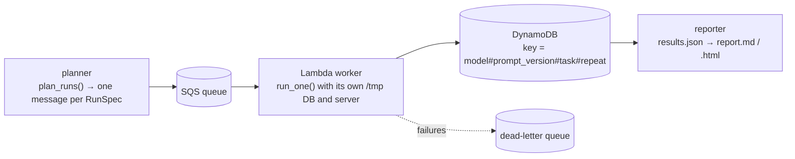

# Extending the harness: Vertex AI, Google ADK, AWS

Status: **design notes. Nothing on this page has been run.** It describes where other
model hosts and runtimes plug in, so the effort can be estimated honestly.

The only contract the runner needs from a model is the `ChatModel` protocol from
mcp-logistica:

```python
class ChatModel(Protocol):
    name: str

    def complete(self, messages: Sequence[Message], tools: Sequence[ToolSpec]) -> AssistantTurn: ...
```

`messages` and `tools` are in the OpenAI chat format. `AssistantTurn` holds text and/or
tool calls. `MeteredModel` wraps any completion function with that shape and records tokens,
cost and latency.

## Gemini on Vertex AI (through LiteLLM, no code change)

LiteLLM routes `vertex_ai/<model>` names to Vertex AI with Google Cloud credentials instead
of an API key. The harness code path is the same as for `gemini/<model>`:

```bash
gcloud auth application-default login          # or GOOGLE_APPLICATION_CREDENTIALS=<service account json>
export VERTEXAI_PROJECT=<your-project> VERTEXAI_LOCATION=<region>
make eval-live MODELS="vertex_ai/<gemini model>" TASKS=order_status_by_id
```

Check the variable names against the
[LiteLLM Vertex AI docs](https://docs.litellm.ai/docs/providers/vertex) for the version you
install. Not run for this repository.

## A Google ADK agent behind the runner (not implemented)

An ADK agent owns its own loop: it decides when to call tools and when to answer. There are
two ways to evaluate one here.

1. **Model only.** Keep this harness's loop and put the model that the ADK agent would use
   behind `ChatModel` (for Gemini, through LiteLLM as above). This measures the model and the
   prompt, not ADK's orchestration.
2. **Whole agent.** Replace `run_conversation` with an adapter that:
   - gives the ADK agent the MCP server as a toolset (ADK has an MCP toolset that can start a
     stdio server, which would be `python -m wms_mcp.server` with the environment from
     `runner.server_env`);
   - adds `ask_user` as a local function tool that returns the task's next `user_replies`
     entry;
   - streams the agent's events and turns each function call and response into an
     `AgentStep`, and the last text into `final_text`.

   The scorer, the database fingerprint and the reports would not change, because they only
   read `Conversation`. An offline test would use a scripted model inside ADK, the same way
   the mock provider works here.

Option 2 was left out because it adds a large dependency and could not be checked against a
real ADK install in this repository.

## Running the matrix on AWS (not implemented)

Each run is already self-contained (its own temp directory, SQLite file and server process),
which maps onto a queue:



- The DynamoDB key is the same `RunKey` that `--resume` uses locally, so a retried message
  overwrites instead of duplicating.
- API keys would come from Secrets Manager into the worker only. The MCP server subprocess
  gets the allow-listed environment, as it does locally.
- Lambda's 15-minute limit is far above one run. Concurrency is bounded by provider rate
  limits, not by the harness.
- The package and mcp-logistica would be built into a container image, because the worker
  starts the server as a subprocess.
